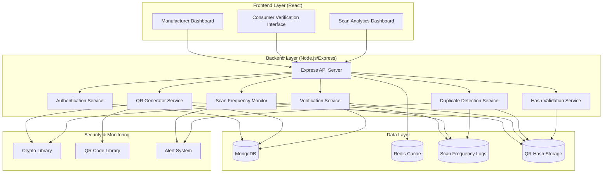

# Design Document: QR-based Product Authentication System

## Overview

The QR-based Product Authentication System is a MERN stack web application specifically designed to prevent counterfeit goods (particularly fake protein supplements) through secure QR code verification. The system enables manufacturers to generate unique, secure QR codes for products while providing consumers with a reliable method to verify authenticity through scan frequency monitoring and duplicate detection.

**Core Anti-Counterfeiting Flow:**
1. Manufacturers generate cryptographically secure QR codes for each product
2. QR data is hashed and stored in MongoDB for tamper detection
3. Consumers scan QR codes via a web application to verify authenticity
4. The system tracks scan frequency and flags suspicious patterns (multiple scans indicating duplicated/fake QR codes)
5. Advanced duplicate detection algorithms identify potential counterfeiting attempts

The architecture follows the MERN stack (MongoDB, Express.js, React, Node.js) with emphasis on scan frequency analytics, duplicate detection algorithms, and comprehensive security monitoring to combat counterfeit products.

## Architecture

### System Architecture



### MERN Stack Implementation Details

- **MongoDB**: Primary database for products, QR codes, scan logs, and hash storage
- **Express.js**: RESTful API server with middleware for authentication, rate limiting, and scan monitoring
- **React**: Frontend dashboard for manufacturers and consumer verification interface
- **Node.js**: Backend runtime with crypto libraries for QR security and hash validation

### Technology Stack

- **Frontend (React)**: React 18+ with TypeScript, React Router, Axios for API calls, Chart.js for scan analytics
- **Backend (Node.js/Express)**: Express.js with TypeScript, JWT authentication, crypto module for hashing
- **Database (MongoDB)**: MongoDB with Mongoose ODM, specialized collections for scan frequency tracking
- **Caching**: Redis for session management, QR code lookup optimization, and scan frequency caching
- **Security**: bcrypt for passwords, SHA-256 for QR data hashing, HMAC for signatures
- **QR Libraries**: qrcode for generation, react-qr-scanner for consumer scanning interface

## Components and Interfaces

### Frontend Components

#### Manufacturer Dashboard
- **ManufacturerAuth**: Login/registration forms with validation
- **ProductManager**: CRUD operations for product management
- **QRGenerator**: Interface for generating and downloading QR codes
- **Analytics**: Dashboard showing verification statistics and trends
- **ProductList**: Paginated list with search and filtering capabilities

#### Verification Interface
- **QRScanner**: Camera-based QR code scanning using react-qr-scanner
- **VerificationResult**: Display verification results with confidence indicators and scan frequency warnings
- **ManualEntry**: Alternative input method for QR code data
- **ProductInfo**: Display verified product information and manufacturer details
- **ScanFrequencyAlert**: Component to display warnings when suspicious scan patterns are detected

### Backend Services

#### Scan Frequency Monitor Service
```typescript
interface ScanFrequencyMonitor {
  recordScan(qrCodeId: string, scanData: ScanEvent): Promise<ScanRecord>
  analyzeScanPattern(qrCodeId: string): Promise<ScanAnalysis>
  detectSuspiciousActivity(qrCodeId: string): Promise<SuspiciousActivityAlert>
  getScanFrequencyStats(qrCodeId: string): Promise<ScanFrequencyStats>
}

interface ScanEvent {
  timestamp: Date
  ipAddress: string
  userAgent: string
  geolocation?: GeoLocation
  sessionId: string
}

interface ScanAnalysis {
  totalScans: number
  uniqueLocations: number
  scanVelocity: number // scans per hour
  suspiciousPatterns: SuspiciousPattern[]
  riskScore: number // 0-100
}

interface SuspiciousPattern {
  type: 'HIGH_FREQUENCY' | 'MULTIPLE_LOCATIONS' | 'RAPID_SUCCESSION' | 'BOT_LIKE'
  severity: 'LOW' | 'MEDIUM' | 'HIGH'
  description: string
  evidence: any[]
}
```

#### Duplicate Detection Service
```typescript
interface DuplicateDetectionService {
  validateQRUniqueness(qrData: string): Promise<UniquenessValidation>
  detectPotentialDuplicates(qrCodeId: string): Promise<DuplicateAnalysis>
  flagSuspiciousQRCode(qrCodeId: string, reason: string): Promise<void>
  analyzeScanDistribution(qrCodeId: string): Promise<DistributionAnalysis>
}

interface UniquenessValidation {
  isUnique: boolean
  conflictingQRCodes: string[]
  hashCollisions: HashCollision[]
}

interface DuplicateAnalysis {
  isDuplicateSuspected: boolean
  confidence: number
  indicators: DuplicateIndicator[]
  recommendedAction: 'MONITOR' | 'FLAG' | 'BLOCK'
}

interface DuplicateIndicator {
  type: 'EXCESSIVE_SCANS' | 'GEOGRAPHIC_ANOMALY' | 'TEMPORAL_PATTERN' | 'HASH_SIMILARITY'
  weight: number
  description: string
}
```

#### Hash Validation Service
```typescript
interface HashValidationService {
  generateQRHash(qrData: string): Promise<string>
  validateQRHash(qrData: string, storedHash: string): Promise<boolean>
  detectHashCollisions(newHash: string): Promise<HashCollision[]>
  storeQRHash(qrCodeId: string, hash: string): Promise<void>
}

interface HashCollision {
  existingQRCodeId: string
  similarity: number
  potentialDuplicate: boolean
}
```

#### Authentication Service
```typescript
interface AuthService {
  registerManufacturer(data: ManufacturerRegistration): Promise<AuthResult>
  authenticateManufacturer(credentials: LoginCredentials): Promise<AuthResult>
  validateToken(token: string): Promise<TokenValidation>
  refreshToken(refreshToken: string): Promise<AuthResult>
}

interface ManufacturerRegistration {
  companyName: string
  email: string
  password: string
  contactInfo: ContactInfo
}

interface AuthResult {
  success: boolean
  token?: string
  refreshToken?: string
  manufacturer?: ManufacturerProfile
  error?: string
}
```

#### QR Generator Service
```typescript
interface QRGeneratorService {
  generateQRCode(productId: string, manufacturerId: string): Promise<QRCodeResult>
  generateBatchQRCodes(productId: string, quantity: number): Promise<QRCodeBatch>
  validateQRSignature(qrData: string): Promise<SignatureValidation>
}

interface QRCodeData {
  productId: string
  manufacturerId: string
  timestamp: number
  signature: string
  batchId?: string
}

interface QRCodeResult {
  qrCodeId: string
  qrData: string
  imageUrl: string
  downloadFormats: QRFormat[]
}
```

#### Verification Service
```typescript
interface VerificationService {
  verifyQRCode(qrData: string, scanContext: ScanContext): Promise<VerificationResult>
  logVerification(verificationData: VerificationLog): Promise<void>
  detectSuspiciousActivity(qrCodeId: string): Promise<SecurityAlert>
  checkScanFrequency(qrCodeId: string): Promise<ScanFrequencyCheck>
}

interface ScanContext {
  ipAddress: string
  userAgent: string
  timestamp: Date
  geolocation?: GeoLocation
  sessionId: string
}

interface VerificationResult {
  isValid: boolean
  confidence: ConfidenceLevel
  product?: ProductInfo
  manufacturer?: ManufacturerInfo
  verificationId: string
  timestamp: number
  warnings?: string[]
  scanFrequencyAlert?: ScanFrequencyAlert
  duplicateRisk?: DuplicateRiskAssessment
}

interface ScanFrequencyAlert {
  level: 'INFO' | 'WARNING' | 'CRITICAL'
  message: string
  scanCount: number
  timeWindow: string
  recommendedAction: string
}

interface DuplicateRiskAssessment {
  riskLevel: 'LOW' | 'MEDIUM' | 'HIGH'
  indicators: string[]
  confidence: number
}
```

### API Endpoints

#### Authentication Endpoints
- `POST /api/auth/register` - Manufacturer registration
- `POST /api/auth/login` - Manufacturer login
- `POST /api/auth/refresh` - Token refresh
- `POST /api/auth/logout` - Logout and token invalidation

#### Product Management Endpoints
- `GET /api/products` - List manufacturer's products
- `POST /api/products` - Create new product
- `PUT /api/products/:id` - Update product
- `DELETE /api/products/:id` - Delete product
- `GET /api/products/:id/qrcodes` - List QR codes for product

#### QR Code Endpoints
- `POST /api/qrcodes/generate` - Generate QR code for product
- `POST /api/qrcodes/batch` - Generate batch of QR codes
- `GET /api/qrcodes/:id/download` - Download QR code in specified format
- `POST /api/qrcodes/verify` - Verify QR code authenticity with scan frequency tracking
- `GET /api/qrcodes/:id/scan-history` - Get scan frequency history for QR code
- `POST /api/qrcodes/:id/flag-suspicious` - Flag QR code as potentially duplicated
- `GET /api/qrcodes/:id/duplicate-analysis` - Get duplicate detection analysis

#### Scan Frequency Monitoring Endpoints
- `GET /api/scan-frequency/:qrCodeId/stats` - Get scan frequency statistics
- `GET /api/scan-frequency/:qrCodeId/alerts` - Get scan frequency alerts
- `POST /api/scan-frequency/analyze-pattern` - Analyze scan patterns for suspicious activity
- `GET /api/scan-frequency/dashboard` - Get scan frequency dashboard data

#### Analytics Endpoints
- `GET /api/analytics/dashboard` - Manufacturer dashboard statistics
- `GET /api/analytics/verifications` - Verification history and trends
- `GET /api/analytics/products/:id/stats` - Product-specific statistics

## Data Models

### MongoDB Schema Design

#### Manufacturer Schema
```typescript
interface Manufacturer {
  _id: ObjectId
  companyName: string
  email: string
  passwordHash: string
  contactInfo: {
    phone?: string
    address?: Address
    website?: string
  }
  isVerified: boolean
  createdAt: Date
  updatedAt: Date
  lastLogin?: Date
}
```

#### Product Schema
```typescript
interface Product {
  _id: ObjectId
  manufacturerId: ObjectId
  name: string
  description: string
  category: string
  sku?: string
  metadata: Record<string, any>
  isActive: boolean
  createdAt: Date
  updatedAt: Date
  qrCodeCount: number
}
```

#### QRCode Schema
```typescript
interface QRCode {
  _id: ObjectId
  productId: ObjectId
  manufacturerId: ObjectId
  qrData: string
  dataHash: string // SHA-256 hash of QR data for duplicate detection
  signature: string
  batchId?: string
  isActive: boolean
  isFlagged: boolean // Flag for suspected duplicates
  flagReason?: string
  createdAt: Date
  verificationCount: number
  lastVerified?: Date
  scanFrequencyStats: {
    totalScans: number
    uniqueIPs: number
    uniqueLocations: number
    lastScanBurst?: Date
    maxScansPerHour: number
    suspiciousActivityScore: number // 0-100
  }
}
```

#### ScanLog Schema (New)
```typescript
interface ScanLog {
  _id: ObjectId
  qrCodeId: ObjectId
  productId: ObjectId
  manufacturerId: ObjectId
  scanTimestamp: Date
  ipAddress: string
  userAgent: string
  geolocation?: {
    latitude: number
    longitude: number
    country: string
    city: string
  }
  sessionId: string
  verificationResult: 'valid' | 'invalid' | 'suspicious'
  scanDuration: number // milliseconds
  deviceFingerprint?: string
}
```

#### QRHashStore Schema (New)
```typescript
interface QRHashStore {
  _id: ObjectId
  qrCodeId: ObjectId
  dataHash: string // SHA-256 hash of QR data
  hashAlgorithm: string // 'SHA-256'
  createdAt: Date
  collisionChecked: boolean
  potentialCollisions: ObjectId[] // References to other QR codes with similar hashes
}
```

#### SuspiciousActivity Schema (New)
```typescript
interface SuspiciousActivity {
  _id: ObjectId
  qrCodeId: ObjectId
  productId: ObjectId
  activityType: 'HIGH_FREQUENCY_SCAN' | 'DUPLICATE_SUSPECTED' | 'GEOGRAPHIC_ANOMALY' | 'BOT_ACTIVITY'
  severity: 'LOW' | 'MEDIUM' | 'HIGH' | 'CRITICAL'
  description: string
  evidence: {
    scanCount?: number
    timeWindow?: string
    locations?: string[]
    ipAddresses?: string[]
    userAgents?: string[]
  }
  detectedAt: Date
  resolved: boolean
  resolvedAt?: Date
  resolvedBy?: ObjectId
  actions: string[] // Actions taken in response
}
```

#### Verification Schema
```typescript
interface Verification {
  _id: ObjectId
  qrCodeId: ObjectId
  productId: ObjectId
  manufacturerId: ObjectId
  result: 'valid' | 'invalid' | 'suspicious'
  confidence: number
  ipAddress: string
  userAgent: string
  location?: GeoLocation
  timestamp: Date
  warnings?: string[]
  scanFrequencyFlags?: string[]
  duplicateRiskScore?: number // 0-100
  sessionId: string
  deviceFingerprint?: string
}
```

### Database Indexing Strategy

- **Manufacturers**: Unique index on email, compound index on (email, isVerified)
- **Products**: Compound index on (manufacturerId, isActive), text index on (name, description)
- **QRCodes**: Unique index on qrData, compound index on (productId, isActive), index on dataHash for duplicate detection
- **ScanLogs**: Compound indexes on (qrCodeId, scanTimestamp), (ipAddress, scanTimestamp), (sessionId, scanTimestamp)
- **QRHashStore**: Unique index on dataHash, compound index on (qrCodeId, createdAt)
- **SuspiciousActivity**: Compound indexes on (qrCodeId, detectedAt), (activityType, severity, resolved)
- **Verifications**: Compound indexes on (qrCodeId, timestamp), (manufacturerId, timestamp), (ipAddress, timestamp)

## Security Implementation

### QR Code Security and Hashing Strategy

The system implements a comprehensive multi-layered security approach specifically designed to prevent counterfeit products through advanced duplicate detection:

1. **Cryptographic Signatures**: Each QR code contains a digital signature created using HMAC-SHA256
2. **Data Hashing for Duplicate Detection**: QR code data is hashed using SHA-256 and stored separately for tamper and duplicate detection
3. **Unique Identifiers**: QR codes include timestamp and random nonce to prevent replay attacks
4. **Scan Frequency Monitoring**: Advanced algorithms track scan patterns to detect suspicious activity
5. **Geographic Analysis**: Location-based scanning patterns help identify duplicate QR codes
6. **Rate Limiting**: API endpoints implement rate limiting to prevent brute force attacks

### Hashing Strategy Details

**Primary Hash Generation:**
```typescript
interface QRHashingStrategy {
  // Primary data hash for duplicate detection
  dataHash: string // SHA-256(qrData + salt)
  
  // Signature hash for authenticity
  signatureHash: string // HMAC-SHA256(dataHash + secret)
  
  // Collision detection hash
  collisionHash: string // SHA-256(productId + manufacturerId + timestamp)
}
```

**Hash Storage and Validation Process:**
1. **Generation**: When QR code is created, generate SHA-256 hash of QR data
2. **Storage**: Store hash in separate collection with collision checking
3. **Verification**: During scan, regenerate hash and compare with stored value
4. **Duplicate Detection**: Check for hash collisions or similar hashes
5. **Flagging**: Automatically flag QR codes with suspicious hash patterns

### Scan Frequency Monitoring Algorithm

**Suspicious Pattern Detection:**
```typescript
interface ScanFrequencyAlgorithm {
  // Thresholds for suspicious activity
  maxScansPerHour: number // Default: 10
  maxScansPerDay: number // Default: 50
  maxUniqueLocationsPerDay: number // Default: 5
  
  // Pattern analysis
  rapidSuccessionThreshold: number // Default: 3 scans in 60 seconds
  geographicAnomalyRadius: number // Default: 100km
  botDetectionScore: number // Based on user agent patterns
}
```

**Real-time Monitoring:**
- Track scan velocity (scans per time unit)
- Monitor geographic distribution of scans
- Detect bot-like scanning patterns
- Flag excessive scanning from single IP/session
- Alert on scans from multiple distant locations simultaneously

### QR Code Data Structure
```typescript
interface SecureQRData {
  v: string        // Version
  pid: string      // Product ID (encrypted)
  mid: string      // Manufacturer ID (encrypted)
  ts: number       // Timestamp
  nonce: string    // Random nonce
  sig: string      // HMAC signature of all above fields
}
```

### Authentication Security

- **Password Security**: bcrypt with salt rounds of 12 for password hashing
- **JWT Tokens**: Short-lived access tokens (15 minutes) with longer refresh tokens (7 days)
- **Token Blacklisting**: Redis-based token blacklist for logout and security incidents
- **Session Management**: Secure session handling with HTTP-only cookies for refresh tokens

### API Security

- **Input Validation**: Comprehensive validation using Joi schemas
- **SQL Injection Prevention**: Mongoose ODM with parameterized queries
- **CORS Configuration**: Restrictive CORS policy for production environments
- **Rate Limiting**: Express-rate-limit with Redis store for distributed rate limiting
- **Security Headers**: Helmet.js for security headers (CSP, HSTS, etc.)

## Error Handling

### Error Classification

1. **Authentication Errors**: Invalid credentials, expired tokens, unauthorized access
2. **Validation Errors**: Invalid input data, missing required fields
3. **Business Logic Errors**: Invalid QR codes, inactive products, verification failures
4. **System Errors**: Database connection issues, external service failures
5. **Security Errors**: Suspicious activity, rate limit exceeded, tampered QR codes

### Error Response Format
```typescript
interface ErrorResponse {
  success: false
  error: {
    code: string
    message: string
    details?: any
    timestamp: string
    requestId: string
  }
}
```

### Error Handling Strategy

- **Client-Side**: React error boundaries with user-friendly error messages
- **API Layer**: Centralized error handling middleware with structured error responses
- **Database Layer**: Connection pooling with automatic retry logic
- **Logging**: Comprehensive error logging with correlation IDs for debugging

## Testing Strategy

The system employs a dual testing approach combining unit tests for specific functionality and property-based tests for universal correctness properties.

### Unit Testing
- **Frontend**: Jest and React Testing Library for component testing
- **Backend**: Jest with supertest for API endpoint testing
- **Database**: MongoDB Memory Server for isolated database testing
- **Integration**: End-to-end testing with Cypress for critical user flows

### Property-Based Testing
Property-based tests will be implemented using fast-check library to verify universal properties across randomized inputs. Each test will run a minimum of 100 iterations to ensure comprehensive coverage.

**Configuration**: Each property test will be tagged with comments referencing the design document property:
```typescript
// Feature: qr-product-authentication, Property 1: QR code generation uniqueness
```

### Testing Coverage Requirements
- **Unit Tests**: Minimum 80% code coverage for critical business logic
- **Property Tests**: All correctness properties must have corresponding property-based tests
- **Integration Tests**: Cover all major user workflows and API interactions
- **Security Tests**: Dedicated tests for authentication, authorization, and QR code security

## Correctness Properties

*A property is a characteristic or behavior that should hold true across all valid executions of a system—essentially, a formal statement about what the system should do. Properties serve as the bridge between human-readable specifications and machine-verifiable correctness guarantees.*

### Property 1: Authentication Round Trip
*For any* valid manufacturer registration data, registering then logging in with those credentials should grant access to the dashboard
**Validates: Requirements 1.1, 1.2**

### Property 2: Invalid Authentication Rejection
*For any* invalid credentials (wrong password, non-existent email, weak passwords), authentication attempts should be rejected and security maintained
**Validates: Requirements 1.3, 1.4**

### Property 3: Session Expiration Enforcement
*For any* expired authentication token, subsequent API requests should require re-authentication
**Validates: Requirements 1.5**

### Property 4: Product Registration Integrity
*For any* valid product data, registering the product should store it with a unique identifier and enforce required fields
**Validates: Requirements 2.1, 2.3**

### Property 5: Product Update Version History
*For any* product update, the system should maintain version history while updating the current record
**Validates: Requirements 2.2**

### Property 6: Product Deletion Cascade
*For any* product deletion, all associated QR codes should be marked as invalid
**Validates: Requirements 2.4**

### Property 7: Manufacturer Product Isolation
*For any* authenticated manufacturer, the dashboard should only display products belonging to that manufacturer
**Validates: Requirements 2.5**

### Property 8: QR Code Generation Uniqueness and Security
*For any* registered product, generating QR codes should create unique, cryptographically secure codes with embedded tamper-resistant data
**Validates: Requirements 3.1, 3.2, 3.3**

### Property 9: Batch QR Code Generation
*For any* product and quantity, batch generation should create the specified number of unique QR codes for that product
**Validates: Requirements 3.4**

### Property 10: QR Code Download Availability
*For any* generated QR code, downloadable formats should be available for printing and labeling
**Validates: Requirements 3.5**

### Property 11: QR Code Decoding Reliability
*For any* valid QR code generated by the system, scanning should decode the embedded data successfully
**Validates: Requirements 4.1**

### Property 12: Invalid QR Code Error Handling
*For any* invalid or corrupted QR code, scanning should provide clear error messaging
**Validates: Requirements 4.2**

### Property 13: Verification Process Initiation
*For any* QR code scan, the verification process should be initiated immediately
**Validates: Requirements 4.5**

### Property 14: Verification Result Accuracy
*For any* QR code verification, valid codes should confirm authenticity while invalid codes should be clearly rejected
**Validates: Requirements 5.1, 5.2**

### Property 15: Verification Information Display
*For any* successful verification, product information including name, manufacturer, and timestamp should be displayed
**Validates: Requirements 5.3**

### Property 16: Verification Event Logging
*For any* verification attempt, the event should be logged for analytics purposes
**Validates: Requirements 5.4**

### Property 17: Verification Confidence Indicators
*For any* verification result, confidence indicators should accurately reflect the strength of the verification
**Validates: Requirements 5.5**

### Property 18: Cryptographic QR Code Security
*For any* generated QR code, it should contain valid cryptographic signatures that prevent forgery
**Validates: Requirements 6.1**

### Property 19: Tamper Detection
*For any* modified QR code data, the verification engine should detect tampering and reject the verification
**Validates: Requirements 6.2**

### Property 20: QR Code Duplication Detection
*For any* QR code, the system should detect and prevent unauthorized duplication through hash comparison
**Validates: Requirements 6.4**

### Property 21: Suspicious Activity Detection
*For any* suspicious verification patterns, the system should flag potential counterfeiting attempts
**Validates: Requirements 6.5**

### Property 22: Dashboard Data Accuracy
*For any* manufacturer login, the dashboard should display accurate overview data including products and QR code statistics
**Validates: Requirements 7.1, 7.3**

### Property 23: Analytics Calculation Accuracy
*For any* verification data, analytics should calculate statistics and geographic distribution correctly
**Validates: Requirements 7.2**

### Property 24: Multi-Format QR Code Downloads
*For any* QR code, the dashboard should provide downloads in multiple formats (PNG, SVG, PDF)
**Validates: Requirements 7.4**

### Property 25: Product Search and Filtering
*For any* search query or filter criteria, the dashboard should return only matching products
**Validates: Requirements 7.5**

### Property 26: Internationalization Support
*For any* supported language, the verification interface should display content in that language
**Validates: Requirements 8.5**

### Property 27: Database ACID Compliance
*For any* data operation, the product registry should maintain ACID properties and data integrity
**Validates: Requirements 9.1**

### Property 28: Concurrent Query Consistency
*For any* concurrent data queries, the system should return consistent results
**Validates: Requirements 9.2**

### Property 29: QR Code Lookup Performance
*For any* QR code verification, lookups should be fast due to proper indexing
**Validates: Requirements 9.3**

### Property 30: Audit Trail Completeness
*For any* data modification, an audit trail entry should be created
**Validates: Requirements 9.4**

### Property 31: RESTful API Compliance
*For any* API endpoint, it should follow REST principles and provide appropriate functionality
**Validates: Requirements 10.1**

### Property 32: API Authentication and Authorization
*For any* API request, authentication tokens should be validated and actions properly authorized
**Validates: Requirements 10.2**

### Property 33: API Response Structure and Rate Limiting
*For any* API request, responses should be properly structured JSON with appropriate HTTP status codes, and rate limiting should prevent abuse
**Validates: Requirements 10.3, 10.4**

### Property 35: Scan Frequency Tracking Accuracy
*For any* QR code scan, the system should accurately record scan frequency data including timestamp, IP address, and geolocation
**Validates: Requirements 6.5**

### Property 36: Duplicate Detection Through Hash Comparison
*For any* QR code data, the system should generate consistent SHA-256 hashes and detect potential duplicates through hash comparison
**Validates: Requirements 6.4**

### Property 37: Suspicious Scan Pattern Detection
*For any* QR code with excessive scan frequency (>10 scans/hour), the system should flag it as potentially duplicated and alert administrators
**Validates: Requirements 6.5**

### Property 38: Geographic Anomaly Detection
*For any* QR code scanned from multiple distant locations simultaneously (>100km apart within 1 hour), the system should flag geographic anomalies
**Validates: Requirements 6.5**

### Property 39: Hash Collision Detection
*For any* newly generated QR code hash, the system should check for collisions with existing hashes and flag potential duplicates
**Validates: Requirements 6.4**

### Property 40: Scan Frequency Alert Generation
*For any* QR code exceeding scan frequency thresholds, the system should generate appropriate alerts with severity levels and recommended actions
**Validates: Requirements 6.5**

### Property 41: Bot Activity Detection
*For any* scanning pattern exhibiting bot-like characteristics (rapid succession, identical user agents, etc.), the system should detect and flag the activity
**Validates: Requirements 6.5**

### Property 42: Duplicate Risk Assessment Accuracy
*For any* QR code verification, the system should provide accurate duplicate risk assessment based on scan patterns, hash analysis, and geographic data
**Validates: Requirements 6.4, 6.5**